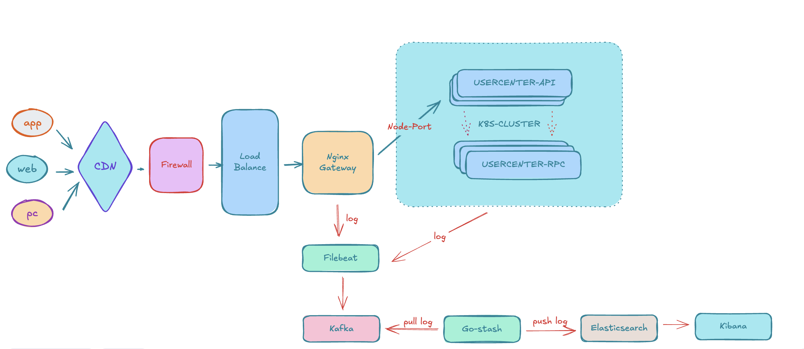

## 系统架构图




## 一.项目启动


#### 1.1 项目初始化
```bash
  mkdir <project name> && cd <project name> # project name 为具体值,我这里是【go-zero-for-k8s】

  go mod init <module name> # module name 为具体值

  go get -u github.com/zeromicro/go-zero@latest
```

#### 1.2 初始化API服务

```bash

  cd <project name>

  mkdir -p app/usercenter/cmd/api/desc

  cd app/usercenter/cmd/api/desc

```
###### 新建usercenter.api文件,添加如下内容
```bash
  # 详见下面文件
  # go-zero-for-k8s/app/usercenter/cmd/api/desc/usercenter.api
```
###### 执行以下命令完善API服务
```bash
  goctl api go -api *.api -dir ../  --style=goZero
```

#### 1.3 初始化RPC服务

```bash

  cd <project name>

  mkdir -p app/usercenter/cmd/rpc/pb

  cd app/usercenter/cmd/rpc/pb

```
###### 新建usercenter.proto文件,添加如下内容
```bash
  # 详见下面文件
  # go-zero-for-k8s/app/usercenter/cmd/rc/pb/usercenter.proto
```
###### 执行以下命令完善RPC服务
```bash
  goctl rpc protoc *.proto --go_out=../ --go-grpc_out=../  --zrpc_out=../ --style=goZero
```

#### 1.4 初始化Model

```bash

  cd <project name>

  mkdir -p app/usercenter/model

  cd <project name>/deploy/script/mysql

```

###### 执行以下命令完善user和user_auth model服务
```bash
  ./genModel.sh usercenter user
  ./genModel.sh usercenter user_auth
```


## 二.项目部署准备


#### 2.1 生成Dockerfile

###### 生成 usercenter-rpc 服务Dockerfile文件
```bash

  cd <project name>/app/usercenter/cmd/rpc

  goctl docker -go usercenter.go

  mv Dockerfile-rpc <project name>/Dockerfile-rpc

```

###### 生成 usercenter-api 服务Dockerfile文件
```bash

  cd <project name>/app/usercenter/cmd/api

  goctl docker -go usercenter.go

  mv Dockerfile-rpc <project name>/gDockerfile-api

```

#### 2.2 构建镜像

###### 构建 usercenter-rpc usercenter-api 服务 image
```bash

  cd <project name>

  # usercenter-rpc image
  docker build -f Dockerfile-rpc -t usercenter-rpc:v1.0 .

  # usercenter-api image
  docker build -f Dockerfile-api -t usercenter-api:v1.0 .

```

#### 2.3 生成usercenter-rpc usercenter-api 服务的k8s部署文件

```bash

  cd <project name>

  # usercenter-rpc deploy.yml
  goctl kube deploy -replicas 3 -requestCpu 200 -requestMem 50 -limitCpu 300 -limitMem 100 -name usercenter-rpc -namespace go-zero-for-k8s -image usercenter-rpc:v1.0 -o k8s-usercenter-rpc.yml -port 8989 --serviceAccount find-endpoints

  # usercenter-api deploy.yml
  goctl kube deploy -nodePort 32190 -replicas 3 -requestCpu 200 -requestMem 50 -limitCpu 300 -limitMem 100 -name usercenter-api -namespace go-zero-for-k8s -image usercenter-api:v1.0 -o k8s-usercenter-api.yml -port 6969 --serviceAccount find-endpoints

```


## 三.部署实施

#### 3.1 克隆项目到本地
```bash

  git clone https://github.com/utagithub/go-zero-for-k8s.git

  cd go-zero-for-k8s

  go mod tidy
```

#### 3.2 创建项目依赖环境专属网络命名空间
```bash

  docker network create go-zero-net
```

#### 3.3 部署项目依赖环境 mysql,redis,nginx,elk等
```bash

  docker-compose -f docker-compose-env.yml  up -d

  docker-compose -f docker-compose-nginx.yml  up -d
```

#### 3.4 设置Kafka
###### 项目中是用来Kafka作为日志搜集的中间件需要先创建日志搜集的topic,
###### go-zero-log 这个topic是应用日志收集使用的
###### go-zero-nginx-log 这个topic是nginx日志收集使用的

###### 进入容器
```shell

  docker exec -it kafka /bin/sh

  cd /opt/kafka/bin/

  ./kafka-topics.sh --create --zookeeper zookeeper:2181 --replication-factor 1 -partitions 1 --topic look-app-log

  ./kafka-topics.sh --create --zookeeper zookeeper:2181 --replication-factor 1 -partitions 1 --topic go-zero-nginx-log

  # 查看有哪些topic
  # kafka-topics.sh --list --zookeeper zookeeper:2181
  # 查看有哪些消费者组
  # kafka-consumer-groups.sh --bootstrap-server kafka:9092 --list
```

#### 3.5 导入mysql数据

###### 本地工具连接mysql的话要先进入容器,给root设置下远程连接权限

```shell
  docker exec -it mysql /bin/bash
  mysql -uroot -p
  ##输入密码:PXDN93VRKUm8TeE7
  use mysql;
  update user set host='%' where user='root';
  FLUSH PRIVILEGES;
```
###### 先创建数据库,然后还原数据表导入数据库:/go-zero-for-k8s/deploy/sql/goods.sql数据(项目数据表)


#### 3.6 创建k8s集群命名空间和授权账户
```bash

    # 先创建k8s集群命名空间
    kubectl create namespace go-zero-for-k8s

    # 后创建授权账户
    kubectl apply -f k8s-authuser.yml

```

#### 3.7 部署usercenter-rpc usercenter-api 服务
```bash

    # 先部署 RPC 服务
    kubectl apply -f k8s-usercenter-rpc.yml
    # kubectl delete -f k8s-usercenter-rpc.yml

    # 后部署 API 服务
    kubectl apply -f k8s-usercenter-api.yml
    # kubectl delete -f k8s-usercenter-api.yml

```

```bash

  get pods -n go-zero-for-k8s
  get svc -n go-zero-for-k8s
  get sa -n go-zero-for-k8s
```


